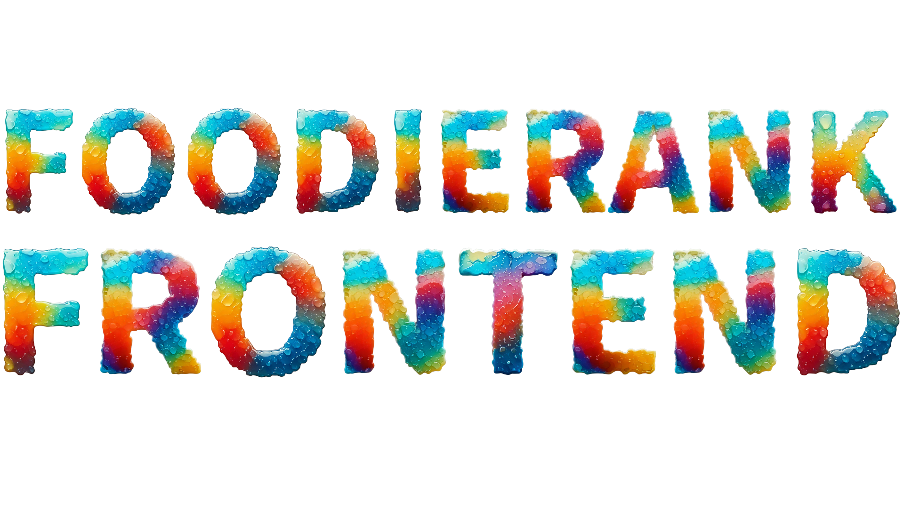

# FOODIERANK - FRONTEND

El frontend de FoodieRank está diseñado como una aplicación web moderna y responsive, construida sobre tecnologías estándar (HTML, CSS y JavaScript) para ofrecer una experiencia de usuario fluida y visualmente atractiva.

La interfaz utiliza un diseño enfocado en la gastronomía, con un esquema de colores basado en tonos tierra (marrones y dorados), manteniendo la consistencia visual a lo largo de las diferentes secciones.

Las principales secciones están diseñadas para ser modulares y dinámicas, cargando la información directamente desde el backend a través de la API.

## 🛠️ Tecnologías Usadas

  
  
  
  
  
  

  <table>
    <tr>
      <td align="center" width="200px">
        
      </td>
      <td align="center" width="200px">
        
      </td>
      <td align="center" width="200px">
        
      </td>
    </tr>
  </table>

